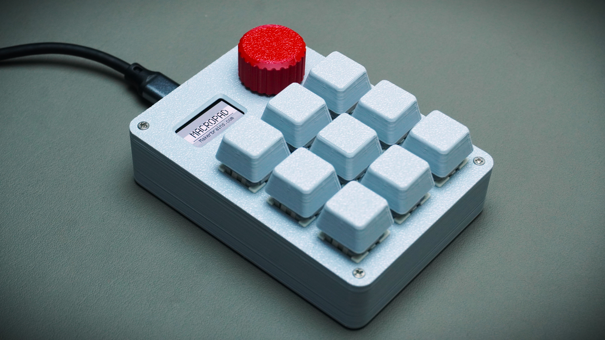
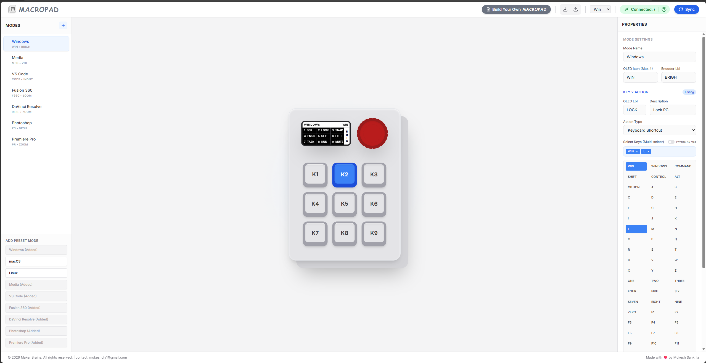
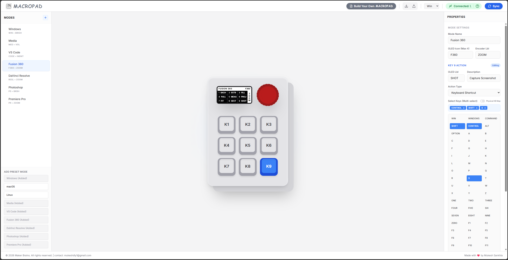
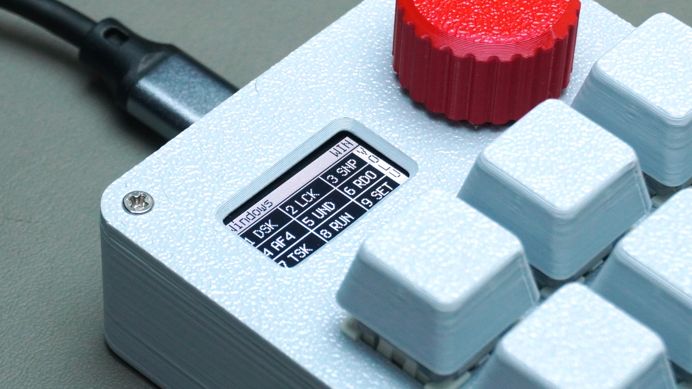
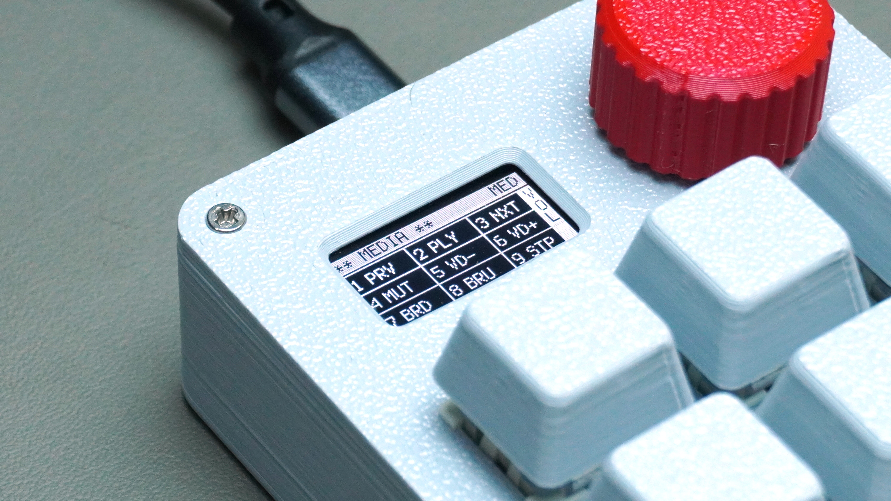

# MACROPAD



Most macropads today rely on custom PCBs and fixed firmware, which makes them difficult to modify, repair, or customize. For this project, I wanted to build something more accessible, modular, and maker-friendly while still looking and feeling like a premium device.

This project encompasses both the physical Macropad (powered by the DFRobot Beetle RP2350 and CircuitPython) and a React + Vite UI for configuring and managing your macros.

For the complete hardware build guide, CAD designs, and step-by-step assembly, check out the full article on Instructables:
**[MACROPAD on Instructables](https://www.instructables.com/MACROPAD/)**

## Gallery

Here are some pictures of the Macropad and its interface:


<br>

<br>

<br>

<br>


## How to Setup and Run the UI

This repository contains the configuration UI for the Macropad, built with React, TypeScript, Vite, and TailwindCSS.

### Prerequisites

- [Node.js](https://nodejs.org/) (v16 or higher recommended)
- npm (comes with Node.js)

### Installation

1. Open a terminal in the project directory (`Macropad_UI`).
2. Install the required dependencies:

```bash
npm install
```

### Running the Development Server

To start the app locally:

```bash
npm run dev
```

The app will be available at `http://localhost:5173` (or the port specified in your terminal).

### Building for Production

To build the application for production, run:

```bash
npm run build
```

This will generate an optimized production build in the `dist` folder.
